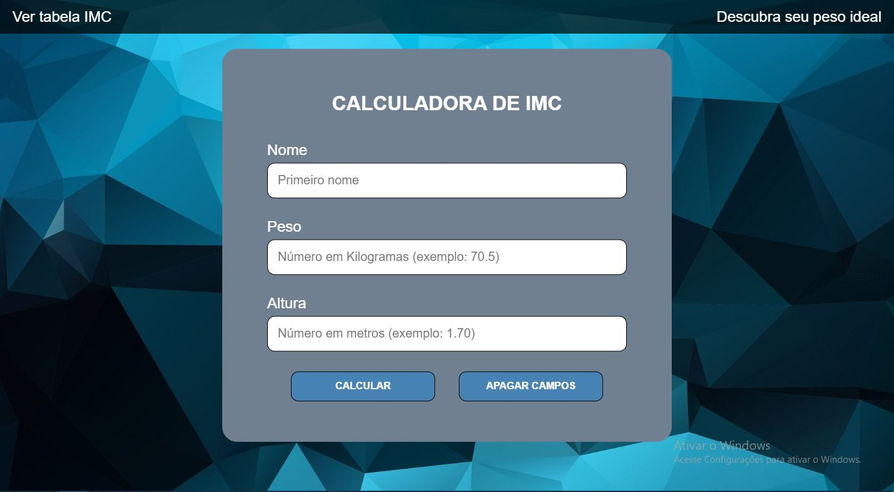
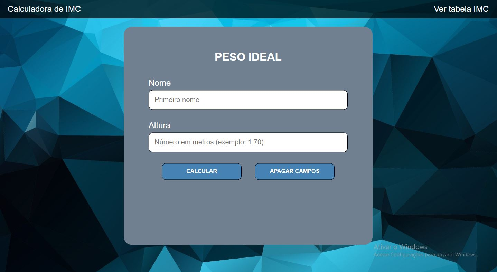
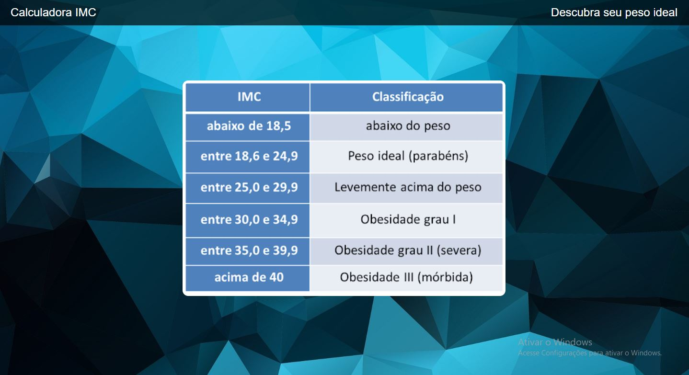

# Calculadora de IMC e Peso Ideal

ACESSE A APLICAÇÃO: https://andrehw27.github.io/Calculadora_IMC_-Peso-Ideal/

Primeiro projeto pessoal, utilizado como aprendizado. Com essa aplicação é possível além de descobrir o seu índice de massa corporal, também qual a faixa de peso ideal baseado em sua estatura, além de conferir a tabela geral de IMC.

Apicação inicialmente criada para computador, porém com toda responsividade para celulares e outros dispositivos móveis (tanto modo retrato quanto paisagem). Vale ressaltar que há um tratamento de erro, caso o usuário insira dados que não sejam válidos, ou mesmo deixe de inserí-los.

Ferramentas utilizadas:

VSCode,
JavaScript,
HTML,
CSS,
Git / GitHub.

HOME

Aqui é possível calcular o seu índice de massa corporal, e receber uma mensagem personalizada com seu nome.

PESO IDEAL

Baseado em sua estatura, é possível descobrir a faixa de peso ideal para você.

TABELA IMC

Por último, é possível conferir uma tabela com todas as faixas de IMC e suas respectivas classificações.

